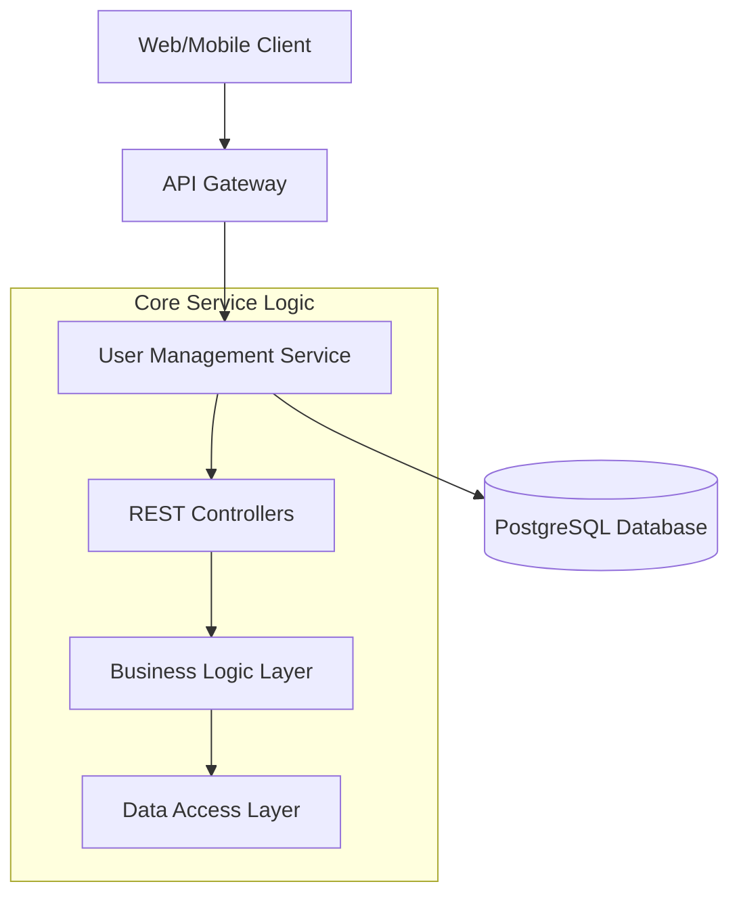

# Microservice Project: User Management

A robust, scalable user management microservice built with **Spring Boot 3.4**, **PostgreSQL**, and modern DevOps practices. This project serves as a foundational component for a distributed microservices ecosystem.

## 🏗️ Architecture

The project follows a modular microservices architecture, emphasizing separation of concerns and independent scalability.

### Current Service: User Service
The **User Service** handles all user-related operations, including registration, profile management, and identity storage.



## 🚀 Quick Start

To set up the entire environment (Services + Database) with a single command:

```bash
./setup.sh --quick
```

This will:
1. Check for necessary dependencies (Docker, etc.).
2. Create a `.env` file if it doesn't exist.
3. Start all services using Docker Compose.

---

## 🏗️ Adding New Services

Follow this pattern to maintain consistency across the project:

### 1. Create the Service Directory
Use a meaningful name (e.g., `order-service`).
```bash
mkdir order-service
cd order-service
# Initialize Spring Boot / Node.js project
```

### 2. Add Docker Context
Create a `Dockerfile` in the new service directory. Use the multi-stage build pattern from the `user` service for consistency.

### 3. Update Orchestration
Add the new service to the root [docker-compose.yml](file:///home/smnaim/microservice-project/docker-compose.yml).
```yaml
  order-service:
    build:
      context: ./order-service
    environment:
      - SPRING_DATASOURCE_URL=jdbc:postgresql://user-db:5432/order_db
    depends_on:
      - user-db
```

### 4. Create Kubernetes Manifests
Add a new deployment/service file in [k8s/](file:///home/smnaim/microservice-project/k8s/) following the existing templates.

### 5. Update CI/CD
Update [.github/workflows/main.yml](file:///home/smnaim/microservice-project/.github/workflows/main.yml) to include build steps for the new service.

---

## 🐳 Dockerization & DevOps

### Containerization Strategy
Each microservice is containerized using **Docker**. A multi-stage Dockerfile is utilized to keep the final image size minimal and secure.

### Infrastructure & Orchestration
- **Docker Compose**: Used for local orchestration.
- **GitHub Actions (CI)**: Automates the build and test process.
- **Kubernetes (CD)**: manifests located in `k8s/` for production-grade orchestration.

### Why this DevOps approach?
1. **Scalability**: Independent scaling of services.
2. **Reliability**: Isolated container environments.
3. **Efficiency**: Automated pipelines (CI/CD).
4. **Resilience**: Kubernetes self-healing and service discovery.
