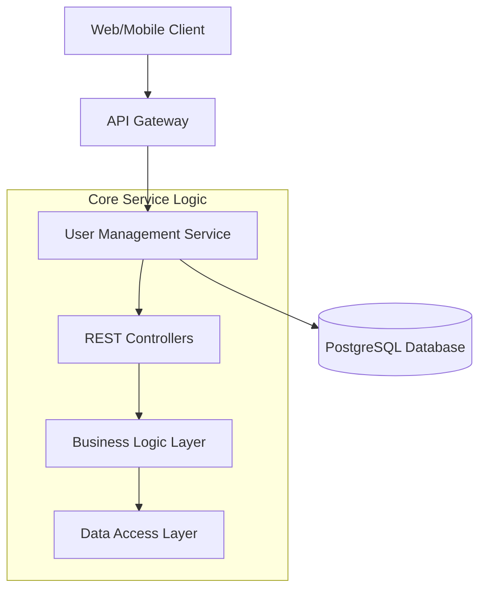

# Microservice Project: User Management

A robust, scalable user management microservice built with **Spring Boot 3.4**, **PostgreSQL**, and modern DevOps practices. This project serves as a foundational component for a distributed microservices ecosystem.

## 🏗️ Architecture

The project follows a modular microservices architecture, emphasizing separation of concerns and independent scalability.

### Current Service: User Service
The **User Service** handles all user-related operations, including registration, profile management, and identity storage.



## 🚀 Setup & Installation

### Prerequisites
- **Java 21** or higher
- **Maven 3.9+**
- **PostgreSQL 15+**
- **Docker & Docker Compose** (for containerized environment)

### Local Development
1. **Clone the repository**:
   ```bash
   git clone <repository-url>
   cd microservice-project/user
   ```

2. **Configure Database**:
   Create a PostgreSQL database named `user_db` and update `src/main/resources/application.properties` with your credentials.

3. **Build and Run**:
   ```bash
   mvn clean install
   mvn spring-boot:run
   ```

## 🛠️ Implementation Brief

The **User Service** is implemented using:
- **Spring Boot**: For building the RESTful API and dependency injection.
- **Spring Data JPA**: For robust database interactions and ORM mapping.
- **Lombok**: To reduce boilerplate code (Getters, Setters, Builders).
- **Validation API**: Ensures data integrity via `@Valid` and JSR-380 annotations.
- **Global Exception Handling**: Centralized error management using `@ControllerAdvice`.

### Key Features
- **User CRUD**: Full lifecycle management for user entities.
- **Email Validation**: Enforced unique email constraints.
- **Audit Fields**: Automatic tracking of `createdAt` and `updatedAt` timestamps.

## 🐳 Dockerization & DevOps

### Containerization Strategy
To ensure environment parity, each microservice is containerized using **Docker**. A multi-stage Dockerfile is utilized to keep the final image size minimal and secure.

```dockerfile
# Stage 1: Build
FROM maven:3.9-eclipse-temurin-21 AS build
COPY . /app
WORKDIR /app
RUN mvn clean package -DskipTests

# Stage 2: Runtime
FROM eclipse-temurin:21-jre-jammy
COPY --from=build /app/target/*.jar app.jar
ENTRYPOINT ["java", "-jar", "/app.jar"]
```

### Infrastructure & Orchestration
- **Docker Compose**: Used for local orchestration, spinning up the `user-service` and `postgresql` database with a single command.
- **GitHub Actions (CI)**: Automates the build and test process on every push, ensuring code quality.
- **Kubernetes (CD)**: Designed for future deployment using K8s for auto-scaling, self-healing, and service discovery.

### Why this DevOps approach?
1. **Scalability**: Independent scaling of the User Service based on traffic demands.
2. **Reliability**: Isolated container environments prevent "it works on my machine" issues.
3. **Efficiency**: Automated pipelines (CI/CD) reduce manual deployment overhead and lead time.
4. **Resilience**: Kubernetes ensures the service remains available even if individual pods fail.
